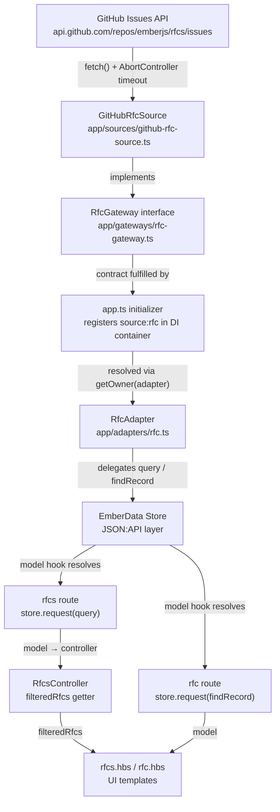
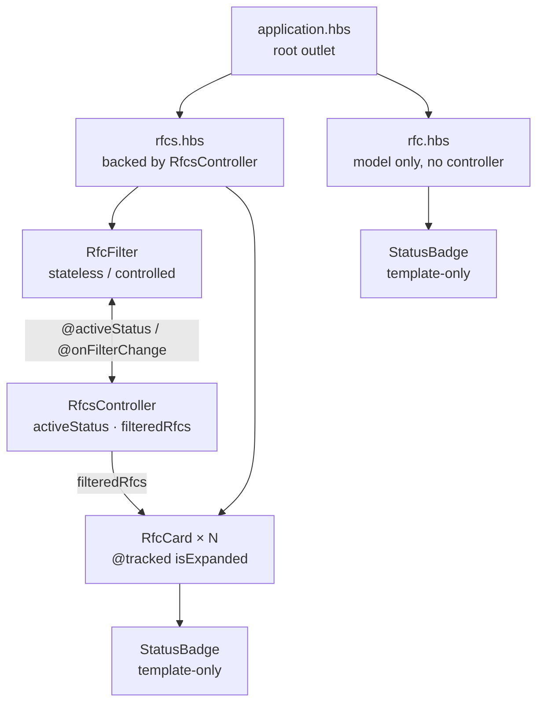

# rfc-embers Architecture

> **Audience:** Mixed — contributors familiar with Ember Octane and those coming from other frontend stacks. Ember-specific terms are briefly explained on first use.

## Overview

**rfc-embers** is an Ember Octane (v6) single-page application that surfaces [Ember RFCs](https://github.com/emberjs/rfcs) from the GitHub Issues API. It fetches RFC issues, maps them to four statuses (`proposed`, `accepted`, `released`, `closed`), and lets users browse and filter them.

**Stack:** Ember 6 + Glimmer components (TypeScript) · EmberData 5 · Embroider + Vite 7 · QUnit test suite · Scoped CSS per component.

---

## Directory Structure

```
app/
├── adapters/        # EmberData adapter — bridges the Store to the gateway
├── components/      # Glimmer UI components (co-located .ts + .hbs + .css)
├── controllers/     # Rfcs controller — holds filter state across route transitions
├── gateways/        # TypeScript interface defining the data-source contract
├── models/          # EmberData models (Rfc, Author) and RfcStatus type
├── routes/          # Route classes that load model data into the store
├── serializers/     # JSON:API serializers (attribute key mapping)
├── services/        # Store service re-export (no customisations)
├── sources/         # Concrete data source: GitHub Issues API implementation
├── styles/          # Global CSS (currently empty placeholder)
└── templates/       # Handlebars templates for routes + loading/error substates

config/              # Ember optional-features flags, browser targets
tests/
├── acceptance/      # Full route-level tests (QUnit + ember-test-helpers)
├── app/sources/     # InMemoryRfcSource test double (fixture data)
├── helpers/         # Test setup wrappers (hook extension points)
├── integration/     # Component rendering tests
└── unit/            # Model, controller, adapter, serializer, route, source tests

vite.config.mjs      # Build pipeline (Embroider + Vite)
```

---

## Data Flow

How data travels from GitHub to the UI:



**Key seam:** `RfcAdapter` never imports `GitHubRfcSource` directly. It resolves `source:rfc` from Ember's dependency-injection container at runtime. Tests replace this registration with `InMemoryRfcSource` before each test — see [Test Architecture](#test-architecture).

---

## Component Hierarchy

How the UI is composed and where state lives:



**Controlled component pattern:** `RfcFilter` owns no state. `RfcsController` owns `activeStatus` and passes it down as an argument; `RfcFilter` calls `@onFilterChange` to request changes. Keeping filter state in the controller means it survives navigation to a child route and back.

---

## Layers

### Routing

Three routes defined in `app/router.ts`:

| URL | Route | Behaviour |
|-----|-------|-----------|
| `/` | `index` | Immediately redirects to `/rfcs` via `redirect()` |
| `/rfcs` | `rfcs` | Fetches all RFCs via `store.request(query('rfc', {}))` |
| `/rfcs/:rfc_id` | `rfc` | Validates id is numeric; fetches via `findRecord` with `reload: true` |

Loading and error substates are handled by co-located templates (`rfcs-loading.hbs`, `rfcs-error.hbs`, `rfc-loading.hbs`, `rfc-error.hbs`) — no extra route classes needed.

### Data Layer

**`RfcGateway` interface** (`app/gateways/rfc-gateway.ts`)
Defines the contract any data source must satisfy: `fetchAll()` and `fetchOne(id)`, both returning JSON:API document shapes. This is the boundary — anything that implements it can be swapped in without touching the rest of the app.

**`GitHubRfcSource`** (`app/sources/github-rfc-source.ts`)
The only production implementation of `RfcGateway`. Hits the GitHub Issues API, maps issue labels to `RfcStatus` values, and serializes responses to JSON:API format. Enforces a 10-second `AbortController` timeout on every request. Registered in the Ember DI container as `source:rfc` by the initializer in `app/app.ts`.

Label → status mapping:

| GitHub label | `RfcStatus` |
|---|---|
| `S-Released` | `released` |
| `S-Recommended` or `S-Ready for Release` | `accepted` |
| `S-Discontinued` | `closed` |
| _(none of the above)_ | `proposed` |

> **Known limitation:** `per_page=100` is GitHub's maximum page size. If the RFC repo exceeds 100 matching issues, results are silently truncated. The source logs a console warning at the boundary but does not paginate.

**`RfcAdapter`** (`app/adapters/rfc.ts`)
Extends EmberData's `JSONAPIAdapter`. Overrides `query()` and `findRecord()` to delegate to the gateway resolved from the container. Does not import `GitHubRfcSource` — the two are decoupled entirely through the DI registration.

**Models**
- `Rfc` — `title`, `number`, `status: RfcStatus`, `summary`, `author: belongsTo('author', { async: false })`
- `Author` — `name`, `githubHandle` (serialised as `github-handle` in JSON:API via `keyForAttribute`)

### Components

| Component | Type | Local state |
|-----------|------|-------------|
| `StatusBadge` | Template-only | None — renders a `<span>` with a `status--{value}` CSS class |
| `RfcCard` | Glimmer class | `@tracked isExpanded` — toggles summary/author visibility |
| `RfcFilter` | Glimmer class | None — fully controlled via `@activeStatus` / `@onFilterChange` |

CSS is co-located per component and scoped via `ember-scoped-css`. Global styles (`app/styles/app.css`) are currently an empty placeholder.

---

## Test Architecture

Tests are a first-class concern. The suite is structured around a clean test seam at the data layer and covers four levels of granularity.

### The Test Seam

The gateway/DI-registration pattern exists primarily to make testing clean and fast. Every acceptance and route test replaces the live source before the test runs:

```ts
this.owner.register('source:rfc', new InMemoryRfcSource(), { instantiate: false });
```

`InMemoryRfcSource` (`tests/app/sources/in-memory-rfc-source.ts`) returns hardcoded fixture data — three RFCs (#724 released, #883 accepted, #900 proposed) — cloned with `structuredClone` so fixtures are never mutated between tests. No real HTTP requests are made in any test.

### Test Levels

| Level | Location | What it covers |
|-------|----------|----------------|
| **Acceptance** | `tests/acceptance/` | Full route transitions, URL changes, loading/error substates, filter interaction end-to-end, `/` → `/rfcs` redirect |
| **Integration** | `tests/integration/components/` | Component rendering and DOM interactions in isolation (`rfc-card`, `rfc-filter`, `status-badge`) |
| **Unit — Routes** | `tests/unit/routes/` | Model hooks, numeric `rfc_id` validation, redirect behaviour |
| **Unit — Controller** | `tests/unit/controllers/` | `filteredRfcs` getter correctness, `activeStatus` reactivity |
| **Unit — Adapter** | `tests/unit/adapters/` | Gateway delegation, `query`/`findRecord` pass-through |
| **Unit — Serializers** | `tests/unit/serializers/` | `keyForAttribute` dasherisation (`githubHandle` ↔ `github-handle`) |
| **Unit — Models** | `tests/unit/models/` | Attribute declarations for `rfc` and `author` |
| **Unit — Sources** | `tests/unit/sources/` | Label → status mapping, null GitHub user handling, AbortController timeout, JSON parse errors, truncation warning |

### Tooling

- **Runner:** QUnit via `ember-qunit`; `qunit-dom` for readable DOM assertions
- **Setup helpers** in `tests/helpers/index.ts` wrap `setupApplicationTest`, `setupRenderingTest`, and `setupTest` — currently passthrough, but structured as extension points for future auth or i18n setup
- `GitHubRfcSource` unit tests use direct `globalThis.fetch` monkey-patching (saved and restored in hooks) — no third-party mock library

---

## Build & Toolchain

| Concern | Tool |
|---------|------|
| Dev server / production build | Vite 7 via `@embroider/vite` |
| Template compilation | `babel-plugin-ember-template-compilation` |
| TypeScript + decorators | `@babel/plugin-transform-typescript` + `decorator-transforms` |
| Test runner | ember-cli + testem + QUnit (`ember test --path dist`) |
| Template type-checking | Glint (`@glint/environment-ember-loose`) |
| CSS scoping | `ember-scoped-css` |
| Linting | ESLint + Prettier (run in parallel with tests via `concurrently`) |

`ember-cli-build.js` does not exist — Embroider/Vite fully owns the build. `ember-cli` is retained only as the test runner harness.

**Scripts:**

```sh
npm start          # Vite dev server
npm run build      # Vite production build
npm test           # All lint:* and test:* scripts in parallel
npm run test:ember # Vite dev build → ember test
```

**Notable optional features** (`config/optional-features.json`):

| Flag | Value | Effect |
|------|-------|--------|
| `template-only-glimmer-components` | `true` | Components with no behaviour need no backing `.ts` file |
| `no-implicit-route-model` | `true` | Controller `model` must be explicitly typed, not inferred |
| `application-template-wrapper` | `false` | No wrapping `<div id="ember-application">` injected around `<body>` |
